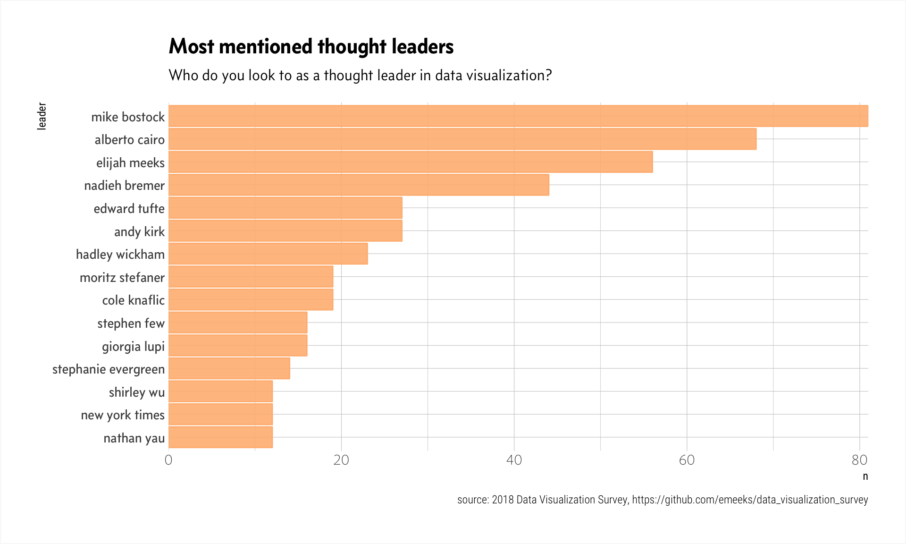

Based on [2018 Data Visualizatio Survey Results](https://medium.com/@Elijah_Meeks/2018-data-visualization-survey-results-26a90856476b) by Elijah Meeks, (GitHub repo [here](https://github.com/emeeks/data_visualization_survey)).


```r
suppressPackageStartupMessages(library(tidyverse))
```


```r
skimr::skim_to_list(results_2018)
```

```
## $character
## # A tibble: 44 x 8
##    variable              missing complete n     min   max   empty n_unique
##  * <chr>                 <chr>   <chr>    <chr> <chr> <chr> <chr> <chr>   
##  1 Age                   0       627      627   3     12    0     6       
##  2 Are you able to choo… 3       624      627   32    73    0     2       
##  3 Data visualization r… 144     483      627   2     193   0     126     
##  4 Did you learn how to… 0       627      627   18    34    0     3       
##  5 Did you set out to w… 1       626      627   38    61    0     2       
##  6 Do you do more or le… 1       626      627   4     41    0     3       
##  7 Do you feel the lead… 139     488      627   2     10    0     3       
##  8 Do you want to spend… 8       619      627   4     9     0     5       
##  9 Experience (Buckets)  0       627      627   3     3     0     4       
## 10 For your current rol… 3       624      627   30    41    0     2       
## # ... with 34 more rows
## 
## $numeric
## # A tibble: 6 x 12
##   variable      missing complete n     mean  sd    p0    p25   p50   p75  
## * <chr>         <chr>   <chr>    <chr> <chr> <chr> <chr> <chr> <chr> <chr>
## 1 How many hou… 27      600      627   2.72  2.79  0     1     2     3.12 
## 2 How many hou… 51      576      627   1.54  2.33  0     0     1     "2  …
## 3 How many yea… 0       627      627   5.09  "3.1… 0     2     4     "7.5…
## 4 I have adequ… 8       619      627   "3.7… 1.05  1     3     4     "4  …
## 5 I want to ma… 8       619      627   3.47  1.21  1     3     4     "4  …
## 6 I’m always o… 8       619      627   3.93  0.98  1     3     4     "5  …
## # ... with 2 more variables: p100 <chr>, hist <chr>
```


Get only records with responses to "thought leaders" question.[^whom]


```r
thought_leaders <- results_2018 %>%
  select(one_of(c("respondent_id", 
                  "Who do you look to as a thought leader in data visualization?"))) %>%
  rename("leader" = "Who do you look to as a thought leader in data visualization?") %>%
  filter(!is.na(leader))

head(thought_leaders)
```

```
## # A tibble: 6 x 2
##   respondent_id leader                                                    
##   <chr>         <chr>                                                     
## 1 2             Lisa Charlotte Rost                                       
## 2 3             New York Times                                            
## 3 4             Edward Tufte, Alberto Cairo, Andy Kirk, Elijah Meeks, Lis…
## 4 5             Elijah Meeks, Nadieh Bremer, Shirley Wu, Mike Bostock     
## 5 6             Mike Bostock, Plotly                                      
## 6 7             Tableau, PowerBI
```

Looks like there's more than one answer per respondent (_duh_)! Let's use `separate_rows()` to tidy things up a bit.


```r
thought_leaders <- thought_leaders %>%
  separate_rows(leader, sep = ",") %>%
  mutate(leader = tolower(leader))
```


```r
skimr::skim(thought_leaders)
```

```
## Skim summary statistics
##  n obs: 770 
##  n variables: 2 
## 
## ── Variable type:character ───────────────────────────────────────────────────────────────────────────────
##       variable missing complete   n min max empty n_unique
##         leader       0      770 770   3  23     0      180
##  respondent_id       0      770 770   1   3     0      322
```

Let's look at the "thought leaders" chosen by more than one respondent (I'm just assuming someone didn't bother to write one name repeatedly, though I guess one could filter for that if so desired).


```r
leader_board <- thought_leaders %>%
  count(leader, sort = TRUE) %>%
  filter(n > 1)

head(leader_board, n = 10)
```

```
## # A tibble: 10 x 2
##    leader              n
##    <chr>           <int>
##  1 mike bostock       81
##  2 alberto cairo      68
##  3 elijah meeks       56
##  4 nadieh bremer      44
##  5 andy kirk          27
##  6 edward tufte       27
##  7 hadley wickham     23
##  8 cole knaflic       19
##  9 moritz stefaner    19
## 10 giorgia lupi       16
```

Now we can rank them, and get the frequencies of leader mentions as a percentage of the total of leaders mentioned more than one time in the survey.


```r
leader_mentions <- leader_board %>%
  mutate(leader = forcats::fct_infreq(leader, ordered = TRUE)) %>%
  summarise(total = sum(n))
  
leader_board <- leader_board %>%
  mutate(total = leader_mentions$total,
         rank = dense_rank(desc(n)),
         freq = n/total)
```


```r
top_10 <- leader_board %>%
  filter(rank <= 10)

top_10 %>%
  mutate(leader = forcats::fct_reorder(leader, as.numeric(n))) %>%
  ggplot(aes(leader, n)) +
  coord_flip() +
  geom_col() + 
  labs(title="Most mentioned thought leaders", 
       subtitle="Data visualization survey 2018") +
  hrbrthemes::theme_ipsum_rc()
```




[^whom]: Yes, it _should_ be "whom," but Elijah is a barbarian, so we'll just have to take things as they are.
